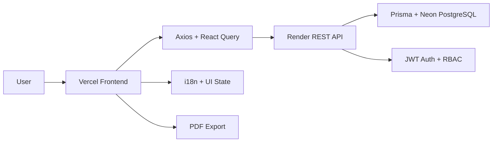
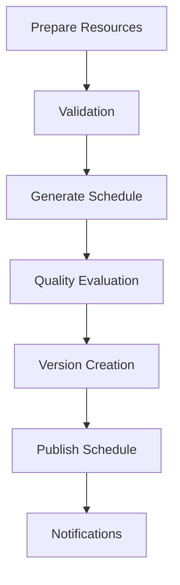

# Smart Multi-Center Exam Scheduling and Optimization System

[](https://vite.dev)
[](https://react.dev)
[](https://www.typescriptlang.org/)
[](https://tailwindcss.com/)
[](LICENSE)

## Overview

This repository contains the React-based frontend for the Smart Multi-Center Exam Scheduling and Optimization System.

The application helps universities and evaluation teams manage academic master data, generate exam schedules, inspect scheduling quality, publish approved timetables, and provide role-based experiences for administrators, students, and proctors.

This README is written for recruiters, developers, contributors, evaluators, and academic reviewers who need a clear view of the product scope, architecture, and delivery pipeline.

## Demo Access

Demo credentials are provided for evaluation purposes only.

| Role | Email | Password |
| --- | --- | --- |
| Admin | [admin01@uni.edu](mailto:admin01@uni.edu) | `Admin@2026#01` |

Use the admin account to explore the full administrative workflow, including academic data management, schedule generation, validation, publishing, and reporting.

## Live Deployment

| Layer | Platform | Responsibility |
| --- | --- | --- |
| Frontend Deployment | Vercel | Hosts the React/Vite single-page application and static assets. |
| Backend Deployment | Render | Serves the REST API consumed by the frontend. |
| Database | Neon DB | Provides the PostgreSQL database used by the backend. |

### Communication Flow

The frontend does not connect to the database directly.

- The browser sends API requests to the backend through Axios clients in `src/api/`.
- `src/config/env.ts` defines the API base URL used at runtime.
- JWT tokens are stored in browser storage and attached to requests by `src/api/axiosclient.ts`.
- React Query manages server-state caching, refetching, and mutations.
- The backend reads and writes data in Neon PostgreSQL through its own persistence layer.

## Tech Stack

| Category | Technology |
| --- | --- |
| UI Framework | React |
| Language | TypeScript |
| Build Tool | Vite |
| Styling | Tailwind CSS |
| Component System | shadcn/ui |
| HTTP Client | Axios |
| Server State | React Query |
| Routing | React Router |
| Authentication | JWT Authentication |
| Authorization | RBAC |
| Reporting | PDF Export |
| Localization | i18n Translation System |

Supporting libraries include Radix UI primitives, React Hook Form, Zod, Recharts, Lucide icons, and i18next language detection.

## Architecture Overview



The frontend is intentionally modular:

- UI composition lives in reusable components and layouts.
- Feature modules organize entity-specific screens and forms.
- Hooks isolate data fetching, mutations, and workflow logic.
- Shared utilities centralize search, schedule counting, auth routing, and date helpers.

## Features

### Mini SIS Management

- Students Management
- Courses Management
- Course Offerings
- Enrollments
- Departments
- Programs
- Semesters
- Centers
- Rooms
- Proctors
- Time Slots
- Exams

### Scheduling Features

- Schedule Generation Dialog
- Scheduling Preparation Workflow
- Scheduling Validation
- Hybrid Scheduling Engine Integration
- Multi-Room Allocation
- Shared-Room Scheduling
- Schedule Quality Evaluation
- Schedule Publishing
- Schedule Versioning
- Schedule Synchronization

### Dashboards

- Administrator Dashboard
- Student Dashboard
- Proctor Dashboard

### Analytics

- Room Utilization
- Proctor Workload Balance
- Student Spacing
- Exam Distribution
- Quality Metrics

### Notifications

- Student Notifications
- Proctor Notifications
- Publish Notifications

### Search System

- Global Search
- Entity Search
- Filtering
- Command Search

### Schedule PDF

- Export Schedule
- Download PDF
- Print Schedule

### User Preferences

- Language Switching
- User Settings
- Notification Preferences

## Scheduling Workflow



The UI reflects this pipeline across scheduling pages, dashboard summaries, validation panels, and published schedule views.

## Project Structure

| Folder | Purpose |
| --- | --- |
| `src/api` | REST API clients, Axios setup, PDF download endpoints, and request helpers. |
| `src/components` | Shared UI components, dashboard widgets, common controls, and reusable page sections. |
| `src/pages` | Route-level screens for admin, student, proctor, auth, dashboard, and shared views. |
| `src/features` | Domain-specific lists, detail dialogs, and feature-oriented UI blocks for entities such as students, courses, rooms, and centers. |
| `src/hooks` | React Query hooks and workflow hooks for data fetching, mutations, filtering, analytics, and schedule operations. |
| `src/lib` | Shared logic such as auth routing, schedule counting, search helpers, date utilities, and query synchronization. |
| `src/schemas` | Typed schemas and frontend data contracts for API responses and validation models. |
| `src/providers` | App-wide providers such as the React Query provider and global wiring. |
| `src/layouts` | Role-aware application shells, sidebars, headers, and navigation scaffolding. |
| `src/forms` | Reusable create/edit forms for administration workflows. |
| `src/guards` | Route guards for authentication and role-based access control. |
| `src/routes` | Route definitions and route orchestration. |
| `src/i18n` | Translation setup, locale registration, and language metadata. |
| `src/assets` | Static frontend assets. |

### Requested but not currently present as dedicated folders

| Folder | Current status |
| --- | --- |
| `src/utils` | Not present as a dedicated folder; shared helpers currently live in `src/lib`. |
| `src/types` | Not present as a dedicated folder; frontend contracts are modeled primarily in `src/schemas`. |
| `src/context` | Not present as a dedicated folder; app-wide wiring is handled in `src/providers`. |

## Screens Overview

| Screen | Description |
| --- | --- |
| Dashboard | High-level operational overview, metrics, and quick actions for the current role. |
| Students | Student records, profile details, filters, and administrative actions. |
| Courses | Course catalog and management view. |
| Course Offerings | Semester-specific course offerings, instructor data, and exam relationships. |
| Enrollments | Student registration tracking and bulk import support. |
| Exams | Exam-related administration and schedule-linked exam operations. |
| Scheduling | Full schedule generation, validation, editing, versioning, and publishing workflow. |
| Analytics | Scheduling quality insights, charts, and optimization summaries. |
| Notifications | Role-specific notification inboxes and publish alerts. |
| Settings | User preferences, account controls, language selection, and notification settings. |

## Environment Variables

The frontend currently uses the following environment variables:

| Variable | Required | Default | Purpose |
| --- | --- | --- | --- |
| `VITE_API_URL` | No | `http://localhost:5000/api` | Backend API base URL used by Axios. |
| `VITE_APP_NAME` | No | `Smart SIS` | Application display name used in the UI. |

### Example local environment file

```env
VITE_API_URL=http://localhost:5000/api
VITE_APP_NAME=Smart Multi-Center Exam Scheduling System
```

## Running Locally

```bash
npm install
npm run dev
```

The development server runs the Vite frontend and connects to the backend API configured in `VITE_API_URL`.

## Build

```bash
npm run build
```

This runs the TypeScript build and produces the optimized production bundle in `dist/`.

## Deployment

### Vercel deployment instructions

1. Push the frontend repository to GitHub.
2. In Vercel, choose New Project and import the client app.
3. Set the Root Directory to client.
4. Confirm the following build settings:
   - Build Command: `npm run build`
   - Output Directory: `dist`
5. Add production environment variables:
   - `VITE_API_URL=https://<your-render-backend>/api`
   - `VITE_APP_NAME=Smart Multi-Center Exam Scheduling System`
6. Deploy and verify that the frontend can reach the Render API over HTTPS.

### Operational note

Because the browser only talks to the backend API, updating the backend URL in Vercel is enough to switch the frontend between local, staging, and production environments.

## Testing

The frontend uses Jest with React Testing Library and JSDOM support.

| Item | Status |
| --- | --- |
| Test runner | Jest |
| DOM environment | JSDOM |
| Assertion helpers | `@testing-library/jest-dom` |
| Setup file | `tests/setupTests.ts` |

Run tests with:

```bash
npm test
```

## Selected Frontend Capabilities

### Dashboard and analytics

- Role-aware summaries for administrators, students, and proctors.
- Schedule overview panels and quality indicators.
- Charts for workload, distribution, and scheduling health.

### Authentication and authorization

- JWT login flow.
- Guarded routes based on user role.
- Session persistence and controlled logout behavior.

### Search and filtering

- Global search across major entities.
- Reusable filters for schedules, students, rooms, and resources.
- Command-style search for fast navigation.

### Localization

- English, French, and Arabic support.
- Direction-aware layout switching for RTL languages.

### PDF export

- Download published schedules as PDFs.
- Print-friendly schedule layouts.
- Role-specific schedule exports for admin, student, and proctor views.

## Future Improvements

- Add end-to-end tests for the scheduling and publishing flow.
- Expand accessibility checks across high-interaction screens.
- Introduce stronger offline and error-state caching for selected workflows.
- Add performance budgets and bundle analysis for larger admin views.
- Expand PDF customization options for institutional branding.
- Document API contracts with generated OpenAPI or typed client artifacts.

## Notes for Contributors

- Keep new screens aligned with the existing role-based routing model.
- Prefer feature-local hooks and components over cross-cutting page logic.
- Reuse the shared API client and React Query patterns for network calls.
- Treat schedule counts, published-state rules, and role permissions as shared business logic.

---

If you are evaluating the system, start with the admin dashboard, then move through schedule generation, validation, publishing, student views, and proctor duties to see the full workflow in action.